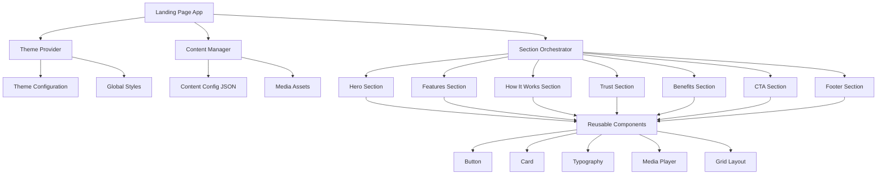
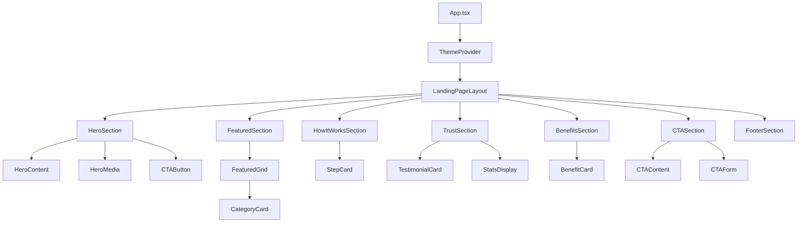
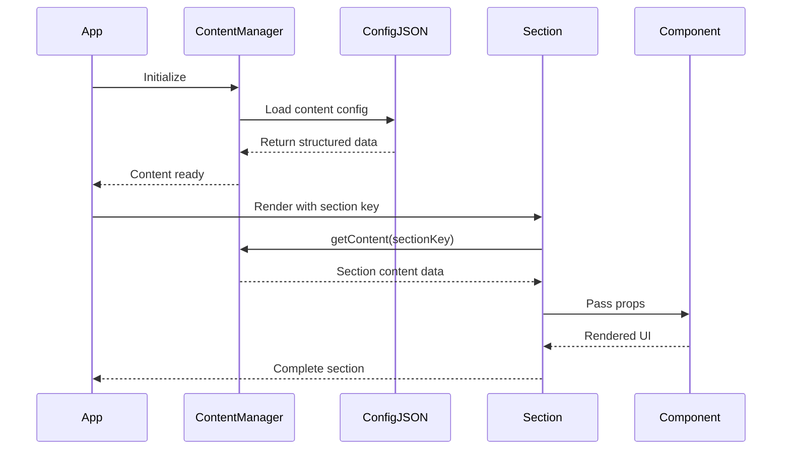
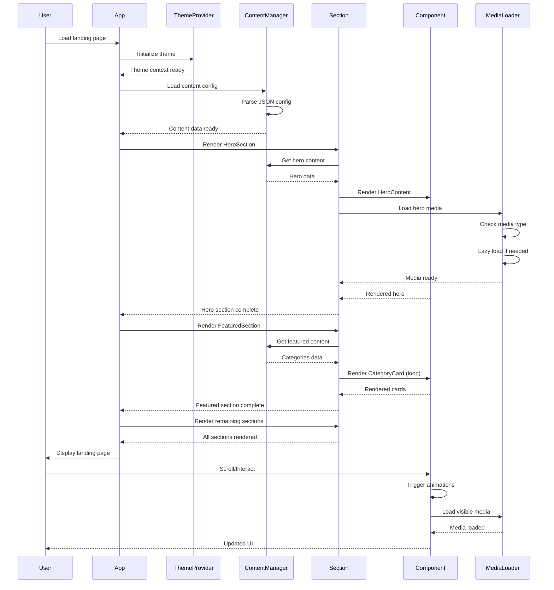

# Design Document: Marketplace Landing Page System

## Overview

The Marketplace Landing Page System is a modern, content-driven, high-conversion landing page built with React (Vite) and TypeScript. The system is architected as a modular, CMS-ready platform where all content (text, images, videos) is externalized into structured configuration files, enabling non-technical users to modify content without touching code. The design emphasizes mobile-first responsiveness, premium visual aesthetics using the provided maroon/navy theme, and scalability for future backend integration. The architecture separates concerns into distinct layers: presentation components, section orchestration, content management, and theme system, ensuring maintainability and extensibility.

**Technology Choice: shadcn/ui** - Selected over Mantine UI for its unstyled, composable primitives built on Radix UI, providing maximum design flexibility while maintaining accessibility. shadcn/ui's copy-paste component model gives full ownership of code without framework lock-in, crucial for achieving a premium, non-template aesthetic. It integrates seamlessly with Tailwind CSS for rapid custom styling aligned with our specific theme colors.

## Architecture

### System Architecture Diagram



### Component Hierarchy



### Data Flow Architecture



## Folder Structure

```
marketplace-landing-page/
├── public/
│   ├── images/
│   │   ├── hero/
│   │   ├── categories/
│   │   ├── testimonials/
│   │   └── logos/
│   └── videos/
├── src/
│   ├── components/
│   │   ├── ui/              # shadcn/ui components
│   │   │   ├── button.tsx
│   │   │   ├── card.tsx
│   │   │   ├── input.tsx
│   │   │   └── ...
│   │   ├── common/          # Reusable components
│   │   │   ├── MediaPlayer.tsx
│   │   │   ├── ResponsiveImage.tsx
│   │   │   ├── AnimatedSection.tsx
│   │   │   └── Grid.tsx
│   │   └── layout/
│   │       ├── Container.tsx
│   │       └── Section.tsx
│   ├── sections/
│   │   ├── HeroSection.tsx
│   │   ├── FeaturedSection.tsx
│   │   ├── HowItWorksSection.tsx
│   │   ├── TrustSection.tsx
│   │   ├── BenefitsSection.tsx
│   │   ├── CTASection.tsx
│   │   └── FooterSection.tsx
│   ├── theme/
│   │   ├── colors.ts
│   │   ├── typography.ts
│   │   ├── spacing.ts
│   │   └── ThemeProvider.tsx
│   ├── data/
│   │   ├── content.config.ts
│   │   ├── types.ts
│   │   └── contentManager.ts
│   ├── hooks/
│   │   ├── useContent.ts
│   │   ├── useMediaQuery.ts
│   │   └── useIntersectionObserver.ts
│   ├── lib/
│   │   └── utils.ts
│   ├── App.tsx
│   ├── main.tsx
│   └── index.css
├── package.json
├── tsconfig.json
├── vite.config.ts
├── tailwind.config.js
├── postcss.config.js
└── components.json         # shadcn/ui config
```

## Components and Interfaces

### Core Type Definitions

```typescript
// src/data/types.ts

export type MediaType = 'image' | 'video' | 'youtube';

export interface MediaAsset {
  type: MediaType;
  src: string;
  alt?: string;
  thumbnail?: string;
  youtubeId?: string;
}

export interface CTAButton {
  text: string;
  href: string;
  variant: 'primary' | 'secondary' | 'outline';
  icon?: string;
}

export interface HeroContent {
  headline: string;
  subheadline: string;
  description: string;
  cta: CTAButton[];
  media: MediaAsset;
  backgroundImage?: string;
}

export interface CategoryItem {
  id: string;
  title: string;
  description: string;
  image: string;
  itemCount: number;
  href: string;
}

export interface StepItem {
  step: number;
  title: string;
  description: string;
  icon: string;
}

export interface TestimonialItem {
  id: string;
  name: string;
  role: string;
  company: string;
  avatar: string;
  rating: number;
  text: string;
}

export interface StatItem {
  value: string;
  label: string;
  icon?: string;
}

export interface BenefitItem {
  id: string;
  title: string;
  description: string;
  icon: string;
}

export interface CTAContent {
  headline: string;
  description: string;
  cta: CTAButton;
  backgroundImage?: string;
}

export interface FooterLink {
  text: string;
  href: string;
}

export interface FooterSection {
  title: string;
  links: FooterLink[];
}

export interface FooterContent {
  logo: string;
  tagline: string;
  sections: FooterSection[];
  social: {
    platform: string;
    href: string;
    icon: string;
  }[];
  copyright: string;
}

export interface LandingPageContent {
  hero: HeroContent;
  featured: {
    title: string;
    subtitle: string;
    categories: CategoryItem[];
  };
  howItWorks: {
    title: string;
    subtitle: string;
    steps: StepItem[];
  };
  trust: {
    title: string;
    stats: StatItem[];
    testimonials: TestimonialItem[];
  };
  benefits: {
    title: string;
    subtitle: string;
    items: BenefitItem[];
  };
  cta: CTAContent;
  footer: FooterContent;
}
```

### Content Manager Interface

```typescript
// src/data/contentManager.ts

export interface IContentManager {
  getContent(): LandingPageContent;
  getSectionContent<K extends keyof LandingPageContent>(
    section: K
  ): LandingPageContent[K];
  updateContent(updates: Partial<LandingPageContent>): void;
}

export class ContentManager implements IContentManager {
  private content: LandingPageContent;

  constructor(initialContent: LandingPageContent) {
    this.content = initialContent;
  }

  getContent(): LandingPageContent {
    return this.content;
  }

  getSectionContent<K extends keyof LandingPageContent>(
    section: K
  ): LandingPageContent[K] {
    return this.content[section];
  }

  updateContent(updates: Partial<LandingPageContent>): void {
    this.content = { ...this.content, ...updates };
  }
}
```

### Theme System Interface

```typescript
// src/theme/colors.ts

export interface ThemeColors {
  primary: string;
  primaryLight: string;
  primaryDark: string;
  secondary: string;
  secondaryLight: string;
  secondaryDark: string;
  background: string;
  surface: string;
  textPrimary: string;
  textSecondary: string;
  textDisabled: string;
  textWhite: string;
  success: string;
  warning: string;
  error: string;
  border: string;
  shadow: string;
}

export const themeColors: ThemeColors = {
  primary: "#800000",
  primaryLight: "#B22222",
  primaryDark: "#4B0000",
  secondary: "#0A1F44",
  secondaryLight: "#274472",
  secondaryDark: "#000B22",
  background: "#F9F8F7",
  surface: "#FFFFFF",
  textPrimary: "#1A1A1A",
  textSecondary: "#7A7A7A",
  textDisabled: "#C1C1C1",
  textWhite: "#FFFFFF",
  success: "#2F855A",
  warning: "#DD6B20",
  error: "#C53030",
  border: "#D9CFCF",
  shadow: "rgba(0, 0, 0, 0.1)",
};

// src/theme/typography.ts

export interface TypographyScale {
  h1: string;
  h2: string;
  h3: string;
  h4: string;
  body: string;
  small: string;
}

export const typography: TypographyScale = {
  h1: "3.5rem",    // 56px
  h2: "2.5rem",    // 40px
  h3: "1.875rem",  // 30px
  h4: "1.5rem",    // 24px
  body: "1rem",    // 16px
  small: "0.875rem" // 14px
};

// src/theme/spacing.ts

export interface SpacingScale {
  xs: string;
  sm: string;
  md: string;
  lg: string;
  xl: string;
  xxl: string;
}

export const spacing: SpacingScale = {
  xs: "0.5rem",   // 8px
  sm: "1rem",     // 16px
  md: "1.5rem",   // 24px
  lg: "2rem",     // 32px
  xl: "3rem",     // 48px
  xxl: "4rem"     // 64px
};
```


### Section Component Interfaces

```typescript
// src/sections/HeroSection.tsx

export interface HeroSectionProps {
  content: HeroContent;
  className?: string;
}

export const HeroSection: React.FC<HeroSectionProps> = ({ content, className }) => {
  // Implementation
};

// src/sections/FeaturedSection.tsx

export interface FeaturedSectionProps {
  title: string;
  subtitle: string;
  categories: CategoryItem[];
  className?: string;
}

export const FeaturedSection: React.FC<FeaturedSectionProps> = ({
  title,
  subtitle,
  categories,
  className
}) => {
  // Implementation
};

// src/sections/HowItWorksSection.tsx

export interface HowItWorksSectionProps {
  title: string;
  subtitle: string;
  steps: StepItem[];
  className?: string;
}

export const HowItWorksSection: React.FC<HowItWorksSectionProps> = ({
  title,
  subtitle,
  steps,
  className
}) => {
  // Implementation
};

// src/sections/TrustSection.tsx

export interface TrustSectionProps {
  title: string;
  stats: StatItem[];
  testimonials: TestimonialItem[];
  className?: string;
}

export const TrustSection: React.FC<TrustSectionProps> = ({
  title,
  stats,
  testimonials,
  className
}) => {
  // Implementation
};

// src/sections/BenefitsSection.tsx

export interface BenefitsSectionProps {
  title: string;
  subtitle: string;
  items: BenefitItem[];
  className?: string;
}

export const BenefitsSection: React.FC<BenefitsSectionProps> = ({
  title,
  subtitle,
  items,
  className
}) => {
  // Implementation
};

// src/sections/CTASection.tsx

export interface CTASectionProps {
  content: CTAContent;
  className?: string;
}

export const CTASection: React.FC<CTASectionProps> = ({ content, className }) => {
  // Implementation
};

// src/sections/FooterSection.tsx

export interface FooterSectionProps {
  content: FooterContent;
  className?: string;
}

export const FooterSection: React.FC<FooterSectionProps> = ({ content, className }) => {
  // Implementation
};
```

### Reusable Component Interfaces

```typescript
// src/components/common/MediaPlayer.tsx

export interface MediaPlayerProps {
  media: MediaAsset;
  className?: string;
  autoPlay?: boolean;
  controls?: boolean;
  lazy?: boolean;
}

export const MediaPlayer: React.FC<MediaPlayerProps> = ({
  media,
  className,
  autoPlay = false,
  controls = true,
  lazy = true
}) => {
  // Implementation
};

// src/components/common/ResponsiveImage.tsx

export interface ResponsiveImageProps {
  src: string;
  alt: string;
  className?: string;
  lazy?: boolean;
  aspectRatio?: string;
}

export const ResponsiveImage: React.FC<ResponsiveImageProps> = ({
  src,
  alt,
  className,
  lazy = true,
  aspectRatio = "16/9"
}) => {
  // Implementation
};

// src/components/common/AnimatedSection.tsx

export interface AnimatedSectionProps {
  children: React.ReactNode;
  animation?: 'fade' | 'slide' | 'scale';
  delay?: number;
  className?: string;
}

export const AnimatedSection: React.FC<AnimatedSectionProps> = ({
  children,
  animation = 'fade',
  delay = 0,
  className
}) => {
  // Implementation
};

// src/components/common/Grid.tsx

export interface GridProps {
  children: React.ReactNode;
  columns?: {
    mobile: number;
    tablet: number;
    desktop: number;
  };
  gap?: string;
  className?: string;
}

export const Grid: React.FC<GridProps> = ({
  children,
  columns = { mobile: 1, tablet: 2, desktop: 3 },
  gap = "1.5rem",
  className
}) => {
  // Implementation
};
```

### Custom Hooks Interfaces

```typescript
// src/hooks/useContent.ts

export interface UseContentReturn {
  content: LandingPageContent;
  getSection: <K extends keyof LandingPageContent>(
    section: K
  ) => LandingPageContent[K];
  isLoading: boolean;
  error: Error | null;
}

export function useContent(): UseContentReturn {
  // Implementation
}

// src/hooks/useMediaQuery.ts

export interface UseMediaQueryReturn {
  isMobile: boolean;
  isTablet: boolean;
  isDesktop: boolean;
  matches: (query: string) => boolean;
}

export function useMediaQuery(): UseMediaQueryReturn {
  // Implementation
}

// src/hooks/useIntersectionObserver.ts

export interface UseIntersectionObserverOptions {
  threshold?: number;
  rootMargin?: string;
  triggerOnce?: boolean;
}

export interface UseIntersectionObserverReturn {
  ref: React.RefObject<HTMLElement>;
  isIntersecting: boolean;
  hasIntersected: boolean;
}

export function useIntersectionObserver(
  options?: UseIntersectionObserverOptions
): UseIntersectionObserverReturn {
  // Implementation
}
```

## Main Algorithm/Workflow



## Key Functions with Formal Specifications

### Function 1: ContentManager.getSectionContent()

```typescript
getSectionContent<K extends keyof LandingPageContent>(
  section: K
): LandingPageContent[K]
```

**Preconditions:**
- `section` is a valid key of `LandingPageContent` type
- `this.content` is initialized and non-null
- `this.content[section]` exists and is well-formed

**Postconditions:**
- Returns the content object for the specified section
- Return type matches the section's content type
- No mutations to internal content state
- Throws error if section key is invalid

**Loop Invariants:** N/A (no loops in function)

### Function 2: MediaPlayer.renderMedia()

```typescript
private renderMedia(media: MediaAsset): React.ReactElement
```

**Preconditions:**
- `media` is non-null and well-formed
- `media.type` is one of: 'image', 'video', 'youtube'
- `media.src` is a valid URL or path string
- For youtube type: `media.youtubeId` is defined

**Postconditions:**
- Returns valid React element for the media type
- Element includes appropriate accessibility attributes
- Lazy loading is applied if `this.props.lazy === true`
- No side effects on input media object

**Loop Invariants:** N/A (no loops in function)

### Function 3: useIntersectionObserver()

```typescript
function useIntersectionObserver(
  options?: UseIntersectionObserverOptions
): UseIntersectionObserverReturn
```

**Preconditions:**
- `options.threshold` is between 0 and 1 (if provided)
- `options.rootMargin` is valid CSS margin string (if provided)
- IntersectionObserver API is available in browser

**Postconditions:**
- Returns object with `ref`, `isIntersecting`, `hasIntersected`
- `ref` is attached to DOM element for observation
- `isIntersecting` reflects current intersection state
- `hasIntersected` is true if element has ever intersected
- Observer is cleaned up on component unmount

**Loop Invariants:** N/A (no loops in function)

### Function 4: Grid.calculateColumns()

```typescript
private calculateColumns(breakpoint: 'mobile' | 'tablet' | 'desktop'): number
```

**Preconditions:**
- `breakpoint` is one of: 'mobile', 'tablet', 'desktop'
- `this.props.columns` is defined with valid column counts
- Column counts are positive integers

**Postconditions:**
- Returns positive integer representing column count
- Return value matches the specified breakpoint
- No mutations to props or state

**Loop Invariants:** N/A (no loops in function)

### Function 5: ContentManager.validateContent()

```typescript
private validateContent(content: unknown): content is LandingPageContent
```

**Preconditions:**
- `content` parameter is provided (may be any type)

**Postconditions:**
- Returns boolean indicating if content is valid
- Type guard ensures content is `LandingPageContent` if true
- Validates all required sections exist
- Validates all required fields within sections
- No mutations to input content

**Loop Invariants:**
- When iterating through sections: all previously validated sections remain valid
- When iterating through section fields: all previously validated fields remain valid

## Algorithmic Pseudocode

### Main Application Initialization Algorithm

```typescript
ALGORITHM initializeApplication()
INPUT: None
OUTPUT: Rendered landing page application

BEGIN
  // Step 1: Load and validate content configuration
  contentConfig ← loadContentConfig()
  ASSERT validateContentStructure(contentConfig) = true
  
  // Step 2: Initialize content manager
  contentManager ← new ContentManager(contentConfig)
  
  // Step 3: Initialize theme provider
  themeContext ← createThemeContext(themeColors, typography, spacing)
  
  // Step 4: Render application with providers
  app ← (
    <ThemeProvider theme={themeContext}>
      <ContentProvider manager={contentManager}>
        <LandingPageLayout />
      </ContentProvider>
    </ThemeProvider>
  )
  
  ASSERT app.isValid() = true
  
  RETURN app
END
```

**Preconditions:**
- Content configuration file exists and is accessible
- Theme configuration is properly defined
- React and required dependencies are loaded

**Postconditions:**
- Application is fully initialized with theme and content
- All providers are properly nested
- Landing page layout is ready to render

**Loop Invariants:** N/A (no loops in algorithm)

### Content Loading and Validation Algorithm

```typescript
ALGORITHM loadAndValidateContent()
INPUT: None
OUTPUT: validated LandingPageContent object

BEGIN
  // Step 1: Load raw content from configuration
  rawContent ← import('./data/content.config')
  
  // Step 2: Validate content structure
  IF NOT isObject(rawContent) THEN
    THROW Error("Content must be an object")
  END IF
  
  // Step 3: Validate required sections with loop invariant
  requiredSections ← ['hero', 'featured', 'howItWorks', 'trust', 'benefits', 'cta', 'footer']
  
  FOR each section IN requiredSections DO
    // Loop invariant: all previously checked sections are valid
    ASSERT allPreviousSectionsValid(rawContent, requiredSections[0..currentIndex])
    
    IF NOT rawContent.hasOwnProperty(section) THEN
      THROW Error(`Missing required section: ${section}`)
    END IF
    
    IF NOT validateSectionStructure(rawContent[section], section) THEN
      THROW Error(`Invalid structure for section: ${section}`)
    END IF
  END FOR
  
  // Step 4: Validate media assets
  mediaAssets ← extractAllMediaAssets(rawContent)
  
  FOR each asset IN mediaAssets DO
    ASSERT allPreviousAssetsValid(mediaAssets[0..currentIndex])
    
    IF NOT validateMediaAsset(asset) THEN
      THROW Error(`Invalid media asset: ${asset.src}`)
    END IF
  END FOR
  
  // Step 5: Return validated content
  validatedContent ← rawContent as LandingPageContent
  
  ASSERT isValidLandingPageContent(validatedContent) = true
  
  RETURN validatedContent
END
```

**Preconditions:**
- Content configuration file exists at expected path
- File contains valid JSON/JavaScript object
- All required sections are defined in configuration

**Postconditions:**
- Returns fully validated `LandingPageContent` object
- All required sections are present and valid
- All media assets are validated
- Throws descriptive error if validation fails

**Loop Invariants:**
- Section validation loop: All previously validated sections remain valid
- Media asset validation loop: All previously validated assets remain valid

### Media Rendering Algorithm

```typescript
ALGORITHM renderMediaAsset(media: MediaAsset, lazy: boolean)
INPUT: media (MediaAsset object), lazy (boolean flag)
OUTPUT: React element for rendering media

BEGIN
  ASSERT media IS NOT NULL
  ASSERT media.type IN ['image', 'video', 'youtube']
  ASSERT media.src IS NOT EMPTY
  
  // Step 1: Determine media type and create appropriate element
  IF media.type = 'image' THEN
    element ← createImageElement(media.src, media.alt, lazy)
    
  ELSE IF media.type = 'video' THEN
    element ← createVideoElement(media.src, lazy)
    
  ELSE IF media.type = 'youtube' THEN
    ASSERT media.youtubeId IS NOT EMPTY
    embedUrl ← `https://www.youtube.com/embed/${media.youtubeId}`
    element ← createIframeElement(embedUrl, lazy)
    
  ELSE
    THROW Error(`Unsupported media type: ${media.type}`)
  END IF
  
  // Step 2: Apply lazy loading if enabled
  IF lazy = true THEN
    element ← applyLazyLoading(element)
  END IF
  
  // Step 3: Add accessibility attributes
  element ← addAccessibilityAttributes(element, media)
  
  ASSERT element.isValid() = true
  
  RETURN element
END
```

**Preconditions:**
- `media` is non-null and well-formed MediaAsset
- `media.type` is valid media type
- `media.src` is non-empty string
- For youtube: `media.youtubeId` is defined

**Postconditions:**
- Returns valid React element for the media type
- Element includes lazy loading if requested
- Element includes accessibility attributes
- No mutations to input media object

**Loop Invariants:** N/A (no loops in algorithm)

### Responsive Grid Layout Algorithm

```typescript
ALGORITHM calculateResponsiveGrid(
  children: ReactNode[],
  columns: ColumnConfig,
  currentBreakpoint: Breakpoint
)
INPUT: children (array of React nodes), columns (column configuration), currentBreakpoint
OUTPUT: Styled grid container with children

BEGIN
  ASSERT children.length > 0
  ASSERT columns.mobile > 0 AND columns.tablet > 0 AND columns.desktop > 0
  ASSERT currentBreakpoint IN ['mobile', 'tablet', 'desktop']
  
  // Step 1: Determine column count for current breakpoint
  IF currentBreakpoint = 'mobile' THEN
    columnCount ← columns.mobile
  ELSE IF currentBreakpoint = 'tablet' THEN
    columnCount ← columns.tablet
  ELSE
    columnCount ← columns.desktop
  END IF
  
  // Step 2: Calculate grid template
  gridTemplate ← `repeat(${columnCount}, 1fr)`
  
  // Step 3: Create grid container with styles
  gridStyles ← {
    display: 'grid',
    gridTemplateColumns: gridTemplate,
    gap: spacing.md,
    width: '100%'
  }
  
  // Step 4: Wrap children in grid container
  gridContainer ← <div style={gridStyles}>{children}</div>
  
  ASSERT gridContainer.children.length = children.length
  
  RETURN gridContainer
END
```

**Preconditions:**
- `children` array is non-empty
- `columns` object has positive integer values for all breakpoints
- `currentBreakpoint` is valid breakpoint value

**Postconditions:**
- Returns grid container with correct column count
- All children are rendered within grid
- Grid styles are properly applied
- No mutations to input children array

**Loop Invariants:** N/A (no loops in algorithm)

### Intersection Observer Hook Algorithm

```typescript
ALGORITHM useIntersectionObserverHook(options: IntersectionObserverOptions)
INPUT: options (threshold, rootMargin, triggerOnce)
OUTPUT: { ref, isIntersecting, hasIntersected }

BEGIN
  ASSERT options.threshold >= 0 AND options.threshold <= 1
  
  // Step 1: Initialize state
  ref ← createRef<HTMLElement>()
  isIntersecting ← useState(false)
  hasIntersected ← useState(false)
  
  // Step 2: Create intersection observer on mount
  useEffect(() => {
    ASSERT ref.current IS NOT NULL
    
    observer ← new IntersectionObserver(
      (entries) => {
        FOR each entry IN entries DO
          // Loop invariant: observer state is consistent
          ASSERT observer.isActive() = true
          
          IF entry.isIntersecting THEN
            isIntersecting.set(true)
            hasIntersected.set(true)
            
            IF options.triggerOnce = true THEN
              observer.unobserve(entry.target)
            END IF
          ELSE
            isIntersecting.set(false)
          END IF
        END FOR
      },
      {
        threshold: options.threshold,
        rootMargin: options.rootMargin
      }
    )
    
    observer.observe(ref.current)
    
    // Cleanup function
    RETURN () => {
      observer.disconnect()
    }
  }, [ref, options])
  
  RETURN { ref, isIntersecting, hasIntersected }
END
```

**Preconditions:**
- `options.threshold` is between 0 and 1
- `options.rootMargin` is valid CSS margin string
- IntersectionObserver API is supported

**Postconditions:**
- Returns ref to attach to DOM element
- Returns current intersection state
- Returns whether element has ever intersected
- Observer is properly cleaned up on unmount

**Loop Invariants:**
- Entry processing loop: Observer remains active throughout iteration
- All processed entries update state consistently

## Example Usage

### Example 1: Basic Application Setup

```typescript
// src/main.tsx
import React from 'react';
import ReactDOM from 'react-dom/client';
import App from './App';
import './index.css';

ReactDOM.createRoot(document.getElementById('root')!).render(
  <React.StrictMode>
    <App />
  </React.StrictMode>
);

// src/App.tsx
import { ThemeProvider } from './theme/ThemeProvider';
import { ContentProvider } from './data/ContentProvider';
import { LandingPageLayout } from './components/layout/LandingPageLayout';
import { contentManager } from './data/contentManager';

function App() {
  return (
    <ThemeProvider>
      <ContentProvider manager={contentManager}>
        <LandingPageLayout />
      </ContentProvider>
    </ThemeProvider>
  );
}

export default App;
```

### Example 2: Content Configuration

```typescript
// src/data/content.config.ts
import { LandingPageContent } from './types';

export const landingPageContent: LandingPageContent = {
  hero: {
    headline: "Discover Your Next Great Find",
    subheadline: "Connect with sellers and buyers in your community",
    description: "Join thousands of users buying and selling everything from vintage furniture to handmade crafts. Your marketplace for unique treasures.",
    cta: [
      {
        text: "Start Selling",
        href: "/sell",
        variant: "primary"
      },
      {
        text: "Browse Listings",
        href: "/browse",
        variant: "outline"
      }
    ],
    media: {
      type: "video",
      src: "/videos/hero-showcase.mp4",
      thumbnail: "/images/hero/thumbnail.jpg"
    },
    backgroundImage: "/images/hero/background.jpg"
  },
  
  featured: {
    title: "Popular Categories",
    subtitle: "Explore our most active marketplaces",
    categories: [
      {
        id: "cat-1",
        title: "Furniture & Home",
        description: "Vintage and modern pieces for every room",
        image: "/images/categories/furniture.jpg",
        itemCount: 1247,
        href: "/category/furniture"
      },
      {
        id: "cat-2",
        title: "Electronics",
        description: "Gadgets, computers, and accessories",
        image: "/images/categories/electronics.jpg",
        itemCount: 892,
        href: "/category/electronics"
      },
      {
        id: "cat-3",
        title: "Fashion & Accessories",
        description: "Clothing, shoes, and jewelry",
        image: "/images/categories/fashion.jpg",
        itemCount: 2103,
        href: "/category/fashion"
      }
    ]
  },
  
  howItWorks: {
    title: "How It Works",
    subtitle: "Start buying and selling in three simple steps",
    steps: [
      {
        step: 1,
        title: "Create Your Account",
        description: "Sign up in seconds and set up your seller profile",
        icon: "user-plus"
      },
      {
        step: 2,
        title: "List Your Items",
        description: "Upload photos, set prices, and describe your items",
        icon: "camera"
      },
      {
        step: 3,
        title: "Connect & Transact",
        description: "Chat with buyers, arrange meetups, and complete sales",
        icon: "handshake"
      }
    ]
  },
  
  trust: {
    title: "Trusted by Thousands",
    stats: [
      { value: "50K+", label: "Active Users", icon: "users" },
      { value: "200K+", label: "Items Sold", icon: "shopping-bag" },
      { value: "4.8/5", label: "Average Rating", icon: "star" },
      { value: "98%", label: "Satisfaction Rate", icon: "thumbs-up" }
    ],
    testimonials: [
      {
        id: "test-1",
        name: "Sarah Johnson",
        role: "Vintage Seller",
        company: "RetroFinds",
        avatar: "/images/testimonials/sarah.jpg",
        rating: 5,
        text: "I've sold over 100 items in the past year. The platform is intuitive and the community is amazing!"
      },
      {
        id: "test-2",
        name: "Michael Chen",
        role: "Electronics Buyer",
        company: "",
        avatar: "/images/testimonials/michael.jpg",
        rating: 5,
        text: "Found incredible deals on tech gear. The seller verification system gives me confidence in every purchase."
      }
    ]
  },
  
  benefits: {
    title: "Why Choose Our Marketplace",
    subtitle: "Everything you need to buy and sell with confidence",
    items: [
      {
        id: "ben-1",
        title: "Secure Transactions",
        description: "Built-in payment protection and verified seller badges",
        icon: "shield-check"
      },
      {
        id: "ben-2",
        title: "Local & Nationwide",
        description: "Connect with sellers in your area or ship nationwide",
        icon: "map-pin"
      },
      {
        id: "ben-3",
        title: "No Listing Fees",
        description: "List unlimited items for free, only pay when you sell",
        icon: "tag"
      },
      {
        id: "ben-4",
        title: "24/7 Support",
        description: "Our team is always here to help with any questions",
        icon: "headphones"
      }
    ]
  },
  
  cta: {
    headline: "Ready to Start Your Marketplace Journey?",
    description: "Join our community today and discover the easiest way to buy and sell locally.",
    cta: {
      text: "Get Started Free",
      href: "/signup",
      variant: "primary"
    },
    backgroundImage: "/images/cta/background.jpg"
  },
  
  footer: {
    logo: "/images/logo.svg",
    tagline: "Your trusted local marketplace",
    sections: [
      {
        title: "Marketplace",
        links: [
          { text: "Browse Listings", href: "/browse" },
          { text: "Categories", href: "/categories" },
          { text: "Sell an Item", href: "/sell" },
          { text: "How It Works", href: "/how-it-works" }
        ]
      },
      {
        title: "Company",
        links: [
          { text: "About Us", href: "/about" },
          { text: "Careers", href: "/careers" },
          { text: "Press", href: "/press" },
          { text: "Blog", href: "/blog" }
        ]
      },
      {
        title: "Support",
        links: [
          { text: "Help Center", href: "/help" },
          { text: "Safety Tips", href: "/safety" },
          { text: "Contact Us", href: "/contact" },
          { text: "Report Issue", href: "/report" }
        ]
      },
      {
        title: "Legal",
        links: [
          { text: "Terms of Service", href: "/terms" },
          { text: "Privacy Policy", href: "/privacy" },
          { text: "Cookie Policy", href: "/cookies" }
        ]
      }
    ],
    social: [
      { platform: "Facebook", href: "https://facebook.com", icon: "facebook" },
      { platform: "Twitter", href: "https://twitter.com", icon: "twitter" },
      { platform: "Instagram", href: "https://instagram.com", icon: "instagram" },
      { platform: "LinkedIn", href: "https://linkedin.com", icon: "linkedin" }
    ],
    copyright: "© 2024 Marketplace. All rights reserved."
  }
};
```

### Example 3: Using Content in Components

```typescript
// src/sections/HeroSection.tsx
import { useContent } from '../hooks/useContent';
import { MediaPlayer } from '../components/common/MediaPlayer';
import { Button } from '../components/ui/button';

export const HeroSection: React.FC = () => {
  const { getSection } = useContent();
  const hero = getSection('hero');
  
  return (
    <section className="hero-section">
      <div className="hero-content">
        <h1>{hero.headline}</h1>
        <h2>{hero.subheadline}</h2>
        <p>{hero.description}</p>
        
        <div className="hero-cta">
          {hero.cta.map((button, index) => (
            <Button
              key={index}
              variant={button.variant}
              href={button.href}
            >
              {button.text}
            </Button>
          ))}
        </div>
      </div>
      
      <div className="hero-media">
        <MediaPlayer media={hero.media} lazy={false} />
      </div>
    </section>
  );
};
```

### Example 4: Custom Hook Usage

```typescript
// Using intersection observer for animations
import { useIntersectionObserver } from '../hooks/useIntersectionObserver';
import { AnimatedSection } from '../components/common/AnimatedSection';

export const FeaturedSection: React.FC = () => {
  const { ref, isIntersecting } = useIntersectionObserver({
    threshold: 0.2,
    triggerOnce: true
  });
  
  return (
    <section ref={ref}>
      <AnimatedSection animation="fade" className={isIntersecting ? 'visible' : ''}>
        {/* Section content */}
      </AnimatedSection>
    </section>
  );
};

// Using media query hook
import { useMediaQuery } from '../hooks/useMediaQuery';

export const ResponsiveComponent: React.FC = () => {
  const { isMobile, isTablet, isDesktop } = useMediaQuery();
  
  return (
    <div>
      {isMobile && <MobileLayout />}
      {isTablet && <TabletLayout />}
      {isDesktop && <DesktopLayout />}
    </div>
  );
};
```

### Example 5: Theme Usage

```typescript
// src/components/ui/button.tsx
import { themeColors } from '../../theme/colors';
import { spacing } from '../../theme/spacing';

export const Button: React.FC<ButtonProps> = ({ variant, children, ...props }) => {
  const getVariantStyles = () => {
    switch (variant) {
      case 'primary':
        return {
          backgroundColor: themeColors.primary,
          color: themeColors.textWhite,
          '&:hover': {
            backgroundColor: themeColors.primaryLight
          }
        };
      case 'secondary':
        return {
          backgroundColor: themeColors.secondary,
          color: themeColors.textWhite,
          '&:hover': {
            backgroundColor: themeColors.secondaryLight
          }
        };
      case 'outline':
        return {
          backgroundColor: 'transparent',
          color: themeColors.primary,
          border: `2px solid ${themeColors.primary}`,
          '&:hover': {
            backgroundColor: themeColors.primary,
            color: themeColors.textWhite
          }
        };
    }
  };
  
  return (
    <button
      style={{
        ...getVariantStyles(),
        padding: `${spacing.sm} ${spacing.md}`,
        borderRadius: '8px',
        fontSize: '1rem',
        fontWeight: 600,
        cursor: 'pointer',
        transition: 'all 0.3s ease'
      }}
      {...props}
    >
      {children}
    </button>
  );
};
```


## Correctness Properties

### Universal Quantification Statements

**Property 1: Content Integrity**
```
∀ section ∈ LandingPageContent.sections:
  contentManager.getSectionContent(section) ≠ null ∧
  contentManager.getSectionContent(section).isValid() = true
```
All sections in the landing page content must be non-null and valid at all times.

**Property 2: Media Asset Validity**
```
∀ media ∈ extractAllMediaAssets(content):
  media.type ∈ {'image', 'video', 'youtube'} ∧
  media.src ≠ ∅ ∧
  (media.type = 'youtube' ⟹ media.youtubeId ≠ ∅)
```
All media assets must have a valid type, non-empty source, and youtube assets must have a youtube ID.

**Property 3: Theme Consistency**
```
∀ component ∈ renderTree:
  component.usesTheme() ⟹ 
    component.colors ⊆ themeColors ∧
    component.spacing ⊆ spacing ∧
    component.typography ⊆ typography
```
All components that use theming must only reference colors, spacing, and typography from the centralized theme configuration.

**Property 4: Responsive Breakpoint Consistency**
```
∀ component ∈ responsiveComponents:
  component.breakpoints = {mobile, tablet, desktop} ∧
  ∀ breakpoint ∈ component.breakpoints:
    component.render(breakpoint).isValid() = true
```
All responsive components must support all three breakpoints and render valid output for each.

**Property 5: Lazy Loading Correctness**
```
∀ media ∈ belowFoldMedia:
  media.lazy = true ⟹
    media.loadTrigger = 'intersection' ∧
    media.loaded = false (until intersecting)
```
All media assets below the fold must use lazy loading and only load when intersecting the viewport.

**Property 6: Accessibility Compliance**
```
∀ interactiveElement ∈ components:
  interactiveElement.hasAccessibleName() = true ∧
  interactiveElement.hasKeyboardSupport() = true ∧
  interactiveElement.hasARIAAttributes() = true
```
All interactive elements must have accessible names, keyboard support, and appropriate ARIA attributes.

**Property 7: CTA Button Validity**
```
∀ cta ∈ extractAllCTAs(content):
  cta.text ≠ ∅ ∧
  cta.href ≠ ∅ ∧
  cta.variant ∈ {'primary', 'secondary', 'outline'}
```
All CTA buttons must have non-empty text and href, and a valid variant.

**Property 8: Grid Layout Consistency**
```
∀ grid ∈ gridComponents:
  grid.columns.mobile > 0 ∧
  grid.columns.tablet ≥ grid.columns.mobile ∧
  grid.columns.desktop ≥ grid.columns.tablet
```
Grid layouts must have positive column counts that increase or stay the same as viewport size increases.

## Error Handling

### Error Scenario 1: Content Loading Failure

**Condition**: Content configuration file fails to load or parse
**Response**: 
- Catch error during content initialization
- Log error details to console
- Display user-friendly error message: "Unable to load page content. Please refresh."
- Provide fallback minimal content structure
**Recovery**: 
- Retry loading after 3 seconds
- If retry fails, use cached content from localStorage if available
- Otherwise, display error boundary with contact support option

### Error Scenario 2: Media Asset Loading Failure

**Condition**: Image, video, or YouTube embed fails to load
**Response**:
- Catch media loading error event
- Display placeholder image with error icon
- Log failed asset URL for debugging
- Continue rendering rest of the page
**Recovery**:
- Provide "Retry" button on placeholder
- Implement exponential backoff for retries (1s, 2s, 4s)
- After 3 failed attempts, show permanent placeholder

### Error Scenario 3: Invalid Media Type

**Condition**: Media asset has unsupported or invalid type
**Response**:
- Validate media type during content loading
- Throw descriptive error: `Unsupported media type: ${media.type}`
- Skip rendering invalid media asset
- Log validation error with asset details
**Recovery**:
- Continue rendering page without invalid asset
- Display warning in development mode
- Report validation error to monitoring service

### Error Scenario 4: Theme Configuration Missing

**Condition**: Theme colors, spacing, or typography not properly defined
**Response**:
- Validate theme configuration on app initialization
- Throw error if required theme properties missing
- Prevent app from rendering with incomplete theme
**Recovery**:
- Use default fallback theme values
- Log warning about missing theme properties
- Display banner in development mode

### Error Scenario 5: Intersection Observer Not Supported

**Condition**: Browser doesn't support IntersectionObserver API
**Response**:
- Check for IntersectionObserver support on hook initialization
- Fall back to loading all media immediately
- Disable scroll-triggered animations
**Recovery**:
- Use polyfill for IntersectionObserver if available
- Otherwise, gracefully degrade to non-lazy loading
- Log browser compatibility warning

### Error Scenario 6: Responsive Breakpoint Mismatch

**Condition**: Component receives invalid breakpoint value
**Response**:
- Validate breakpoint against allowed values
- Throw error: `Invalid breakpoint: ${breakpoint}`
- Default to 'mobile' breakpoint as fallback
**Recovery**:
- Log warning about invalid breakpoint
- Continue rendering with fallback breakpoint
- Update component state to valid breakpoint

### Error Scenario 7: Network Request Timeout

**Condition**: External media or API request exceeds timeout threshold
**Response**:
- Set timeout of 10 seconds for all external requests
- Cancel request and trigger timeout error
- Display timeout message to user
**Recovery**:
- Provide "Retry" button
- Implement request caching for successful loads
- Use cached version if available

## Testing Strategy

### Unit Testing Approach

**Framework**: Vitest + React Testing Library

**Coverage Goals**: 
- Minimum 80% code coverage
- 100% coverage for critical paths (content loading, theme application, media rendering)

**Key Test Suites**:

1. **Content Manager Tests**
   - Test `getSectionContent()` returns correct section data
   - Test `validateContent()` catches invalid structures
   - Test `updateContent()` properly merges updates
   - Test error handling for missing sections

2. **Theme System Tests**
   - Test theme colors are properly applied to components
   - Test spacing and typography scales are accessible
   - Test ThemeProvider context is available to children
   - Test theme values match specification

3. **Component Tests**
   - Test each section component renders with valid props
   - Test components handle missing optional props gracefully
   - Test responsive behavior at different breakpoints
   - Test accessibility attributes are present

4. **Media Player Tests**
   - Test image rendering with lazy loading
   - Test video rendering with controls
   - Test YouTube embed generation
   - Test error handling for invalid media types
   - Test lazy loading triggers on intersection

5. **Hook Tests**
   - Test `useContent()` returns content and section getters
   - Test `useMediaQuery()` detects correct breakpoints
   - Test `useIntersectionObserver()` triggers on intersection
   - Test hook cleanup on unmount

**Example Unit Test**:
```typescript
describe('ContentManager', () => {
  it('should return valid section content', () => {
    const manager = new ContentManager(mockContent);
    const heroContent = manager.getSectionContent('hero');
    
    expect(heroContent).toBeDefined();
    expect(heroContent.headline).toBe(mockContent.hero.headline);
    expect(heroContent.cta).toHaveLength(2);
  });
  
  it('should throw error for invalid section', () => {
    const manager = new ContentManager(mockContent);
    
    expect(() => {
      manager.getSectionContent('invalid' as any);
    }).toThrow('Invalid section key');
  });
});
```

### Property-Based Testing Approach

**Property Test Library**: fast-check

**Property Test Suites**:

1. **Content Validation Properties**
   - Property: Any valid LandingPageContent passes validation
   - Property: Invalid content structures always fail validation
   - Property: Content with missing required fields fails validation
   - Generator: Create arbitrary valid and invalid content structures

2. **Media Rendering Properties**
   - Property: Any valid MediaAsset renders without errors
   - Property: Media with invalid type throws error
   - Property: Lazy loading always defers load until intersection
   - Generator: Create arbitrary MediaAsset objects

3. **Grid Layout Properties**
   - Property: Grid with N children renders exactly N items
   - Property: Column count never exceeds children count
   - Property: Grid gap is always non-negative
   - Generator: Create arbitrary grid configurations

4. **Theme Application Properties**
   - Property: All theme colors are valid hex codes
   - Property: All spacing values are valid CSS units
   - Property: Typography scales are monotonically increasing
   - Generator: Create arbitrary theme configurations

**Example Property Test**:
```typescript
import fc from 'fast-check';

describe('Content Validation Properties', () => {
  it('should validate any well-formed content', () => {
    fc.assert(
      fc.property(
        fc.record({
          hero: heroContentArbitrary,
          featured: featuredContentArbitrary,
          // ... other sections
        }),
        (content) => {
          const isValid = validateContent(content);
          expect(isValid).toBe(true);
        }
      )
    );
  });
  
  it('should reject content with missing sections', () => {
    fc.assert(
      fc.property(
        fc.record({
          hero: heroContentArbitrary,
          // Missing other required sections
        }),
        (incompleteContent) => {
          const isValid = validateContent(incompleteContent);
          expect(isValid).toBe(false);
        }
      )
    );
  });
});
```

### Integration Testing Approach

**Framework**: Playwright for E2E testing

**Test Scenarios**:

1. **Full Page Load Test**
   - Navigate to landing page
   - Verify all sections render in correct order
   - Verify hero section appears above fold
   - Verify footer appears at bottom

2. **Content Display Test**
   - Verify hero headline matches content config
   - Verify all category cards render with correct data
   - Verify testimonials display with ratings
   - Verify CTA buttons have correct text and links

3. **Responsive Behavior Test**
   - Test page at mobile viewport (375px)
   - Test page at tablet viewport (768px)
   - Test page at desktop viewport (1440px)
   - Verify grid layouts adjust correctly
   - Verify navigation adapts to viewport

4. **Media Loading Test**
   - Verify hero media loads immediately
   - Verify below-fold media lazy loads
   - Scroll to trigger lazy loading
   - Verify all media eventually loads

5. **Interaction Test**
   - Click CTA buttons and verify navigation
   - Hover over cards and verify hover effects
   - Test keyboard navigation through interactive elements
   - Verify focus indicators are visible

6. **Performance Test**
   - Measure First Contentful Paint (FCP) < 1.5s
   - Measure Largest Contentful Paint (LCP) < 2.5s
   - Measure Time to Interactive (TTI) < 3.5s
   - Verify no layout shifts (CLS < 0.1)

**Example Integration Test**:
```typescript
test('landing page loads and displays all sections', async ({ page }) => {
  await page.goto('/');
  
  // Verify hero section
  await expect(page.locator('section.hero-section')).toBeVisible();
  await expect(page.locator('h1')).toContainText('Discover Your Next Great Find');
  
  // Verify featured section
  await expect(page.locator('section.featured-section')).toBeVisible();
  const categoryCards = page.locator('.category-card');
  await expect(categoryCards).toHaveCount(3);
  
  // Verify footer
  await expect(page.locator('footer')).toBeVisible();
  await expect(page.locator('footer')).toContainText('© 2024 Marketplace');
});
```

## Performance Considerations

### Image Optimization Strategy

**Approach**: 
- Use modern image formats (WebP with JPEG fallback)
- Implement responsive images with `srcset` and `sizes` attributes
- Compress images to appropriate quality levels (80-85% for photos)
- Generate multiple image sizes for different viewports (320w, 640w, 1024w, 1920w)

**Implementation**:
```typescript
<ResponsiveImage
  src="/images/hero/main.jpg"
  srcSet="/images/hero/main-320w.webp 320w,
          /images/hero/main-640w.webp 640w,
          /images/hero/main-1024w.webp 1024w,
          /images/hero/main-1920w.webp 1920w"
  sizes="(max-width: 768px) 100vw, (max-width: 1024px) 80vw, 1200px"
  alt="Hero image"
/>
```

**Expected Impact**: 40-60% reduction in image payload size

### Lazy Loading Strategy

**Approach**:
- Eager load above-the-fold content (hero section)
- Lazy load all below-the-fold images and videos
- Use IntersectionObserver with 200px rootMargin for preloading
- Implement loading="lazy" attribute as fallback

**Implementation**:
```typescript
const { ref, isIntersecting } = useIntersectionObserver({
  threshold: 0.1,
  rootMargin: '200px',
  triggerOnce: true
});

{isIntersecting && }
```

**Expected Impact**: 30-40% faster initial page load

### Code Splitting Strategy

**Approach**:
- Split sections into separate chunks using React.lazy()
- Load critical sections (Hero, Featured) immediately
- Lazy load non-critical sections (Trust, Benefits, Footer)
- Prefetch lazy chunks on user interaction or idle time

**Implementation**:
```typescript
const TrustSection = React.lazy(() => import('./sections/TrustSection'));
const BenefitsSection = React.lazy(() => import('./sections/BenefitsSection'));

<Suspense fallback={<SectionSkeleton />}>
  <TrustSection content={content.trust} />
</Suspense>
```

**Expected Impact**: 25-35% reduction in initial JavaScript bundle size

### Caching Strategy

**Approach**:
- Cache static assets (images, fonts, CSS) with long TTL (1 year)
- Use content hashing for cache busting
- Implement service worker for offline support
- Cache content configuration in localStorage with 1-hour TTL

**Implementation**:
```typescript
// Cache content in localStorage
const CACHE_KEY = 'landing-page-content';
const CACHE_TTL = 3600000; // 1 hour

const cachedContent = localStorage.getItem(CACHE_KEY);
if (cachedContent && !isCacheExpired(cachedContent)) {
  return JSON.parse(cachedContent);
}
```

**Expected Impact**: Instant subsequent page loads

### Bundle Size Optimization

**Approach**:
- Tree-shake unused code with Vite's built-in optimization
- Use dynamic imports for large dependencies (Framer Motion)
- Minimize third-party dependencies
- Use shadcn/ui's copy-paste model to include only needed components

**Target Bundle Sizes**:
- Initial JS bundle: < 150KB gzipped
- Initial CSS bundle: < 30KB gzipped
- Total initial payload: < 500KB

### Animation Performance

**Approach**:
- Use CSS transforms and opacity for animations (GPU-accelerated)
- Avoid animating layout properties (width, height, top, left)
- Use `will-change` sparingly for critical animations
- Implement `requestAnimationFrame` for JavaScript animations

**Implementation**:
```css
.fade-in {
  animation: fadeIn 0.6s ease-out;
  will-change: opacity, transform;
}

@keyframes fadeIn {
  from {
    opacity: 0;
    transform: translateY(20px);
  }
  to {
    opacity: 1;
    transform: translateY(0);
  }
}
```

**Expected Impact**: Maintain 60fps during animations

## Security Considerations

### Content Security Policy (CSP)

**Approach**: Implement strict CSP headers to prevent XSS attacks

**Policy**:
```
Content-Security-Policy:
  default-src 'self';
  script-src 'self' 'unsafe-inline' https://www.youtube.com;
  style-src 'self' 'unsafe-inline';
  img-src 'self' data: https:;
  media-src 'self' https:;
  frame-src https://www.youtube.com;
  connect-src 'self' https://api.marketplace.com;
```

**Rationale**: 
- Restrict script sources to prevent malicious code injection
- Allow YouTube embeds for video content
- Allow HTTPS images from CDN
- Restrict API connections to known endpoints

### Input Sanitization

**Approach**: Sanitize all user-generated content before rendering

**Implementation**:
```typescript
import DOMPurify from 'dompurify';

const sanitizeContent = (html: string): string => {
  return DOMPurify.sanitize(html, {
    ALLOWED_TAGS: ['b', 'i', 'em', 'strong', 'p', 'br'],
    ALLOWED_ATTR: []
  });
};
```

**Application**: 
- Sanitize testimonial text
- Sanitize user-provided descriptions
- Escape special characters in URLs

### Secure Media Loading

**Approach**: Validate and sanitize media URLs before loading

**Implementation**:
```typescript
const isValidMediaUrl = (url: string): boolean => {
  try {
    const parsed = new URL(url);
    return ['http:', 'https:'].includes(parsed.protocol);
  } catch {
    return false;
  }
};

const validateYouTubeId = (id: string): boolean => {
  return /^[a-zA-Z0-9_-]{11}$/.test(id);
};
```

**Protection**: Prevent loading malicious content from untrusted sources

### HTTPS Enforcement

**Approach**: Enforce HTTPS for all connections

**Implementation**:
- Configure Vite to use HTTPS in development
- Set up HTTPS redirects in production
- Use HSTS header: `Strict-Transport-Security: max-age=31536000; includeSubDomains`

### Dependency Security

**Approach**: Regular security audits and updates

**Process**:
- Run `npm audit` before each deployment
- Use Dependabot for automated dependency updates
- Review security advisories for React and Vite
- Pin dependency versions in package.json

### API Security (Future Backend Integration)

**Approach**: Prepare for secure API communication

**Considerations**:
- Use JWT tokens for authentication
- Implement rate limiting on API endpoints
- Validate all API responses before rendering
- Use CORS headers to restrict API access
- Implement request signing for sensitive operations

### Privacy Considerations

**Approach**: Respect user privacy and comply with regulations

**Implementation**:
- No tracking scripts without user consent
- Cookie consent banner for analytics
- Privacy policy link in footer
- No PII stored in localStorage without encryption
- Implement "Do Not Track" header respect

## Dependencies

### Core Dependencies

**React Ecosystem**:
- `react` (^18.2.0) - UI library
- `react-dom` (^18.2.0) - React DOM renderer
- `vite` (^5.0.0) - Build tool and dev server

**TypeScript**:
- `typescript` (^5.3.0) - Type safety and developer experience

**UI Components**:
- `@radix-ui/react-*` (^1.0.0) - Unstyled accessible components (via shadcn/ui)
- `class-variance-authority` (^0.7.0) - Component variant management
- `clsx` (^2.0.0) - Conditional className utility
- `tailwind-merge` (^2.0.0) - Tailwind class merging

**Styling**:
- `tailwindcss` (^3.4.0) - Utility-first CSS framework
- `postcss` (^8.4.0) - CSS processing
- `autoprefixer` (^10.4.0) - CSS vendor prefixing

**Animation** (Optional):
- `framer-motion` (^10.16.0) - Animation library for React

**Icons**:
- `lucide-react` (^0.294.0) - Icon library (recommended for shadcn/ui)

### Development Dependencies

**Testing**:
- `vitest` (^1.0.0) - Unit test framework
- `@testing-library/react` (^14.0.0) - React component testing
- `@testing-library/jest-dom` (^6.1.0) - Custom Jest matchers
- `@testing-library/user-event` (^14.5.0) - User interaction simulation
- `fast-check` (^3.15.0) - Property-based testing
- `@playwright/test` (^1.40.0) - E2E testing

**Code Quality**:
- `eslint` (^8.55.0) - JavaScript/TypeScript linting
- `@typescript-eslint/parser` (^6.15.0) - TypeScript ESLint parser
- `@typescript-eslint/eslint-plugin` (^6.15.0) - TypeScript ESLint rules
- `prettier` (^3.1.0) - Code formatting
- `eslint-config-prettier` (^9.1.0) - Disable ESLint rules that conflict with Prettier

**Build Tools**:
- `@vitejs/plugin-react` (^4.2.0) - Vite React plugin
- `vite-plugin-svgr` (^4.2.0) - SVG as React components

### Optional Dependencies

**Performance Monitoring**:
- `web-vitals` (^3.5.0) - Core Web Vitals measurement

**Security**:
- `dompurify` (^3.0.0) - HTML sanitization

**Utilities**:
- `date-fns` (^2.30.0) - Date manipulation (if needed for timestamps)

### Dependency Justification

**Why shadcn/ui over Mantine UI**:
1. **Design Flexibility**: shadcn/ui provides unstyled primitives, allowing complete control over visual design to achieve premium, non-template aesthetic
2. **No Framework Lock-in**: Copy-paste model means components are owned by the project, not imported from external package
3. **Tailwind Integration**: Seamless integration with Tailwind CSS for rapid custom styling
4. **Bundle Size**: Only include components actually used, reducing bundle size
5. **Accessibility**: Built on Radix UI, ensuring WCAG compliance out of the box
6. **Customization**: Easy to modify component source code to match exact design requirements

**Why Vite over Create React App**:
1. **Performance**: Faster dev server startup and HMR
2. **Modern**: Built for modern browsers with native ESM support
3. **Optimized**: Better production build optimization
4. **Flexibility**: More configurable than CRA

**Why Framer Motion (Optional)**:
1. **Declarative**: Easy-to-use declarative animation API
2. **Performance**: Optimized for 60fps animations
3. **Features**: Advanced features like layout animations and gestures
4. **Bundle Size**: Tree-shakeable, only include what you use

### Dependency Management Strategy

**Version Pinning**:
- Pin major and minor versions in package.json
- Allow patch updates with `~` prefix
- Lock exact versions in package-lock.json

**Update Schedule**:
- Review and update dependencies monthly
- Apply security patches immediately
- Test thoroughly after major version updates

**Bundle Analysis**:
- Use `vite-bundle-visualizer` to analyze bundle size
- Remove unused dependencies regularly
- Consider alternatives for large dependencies

